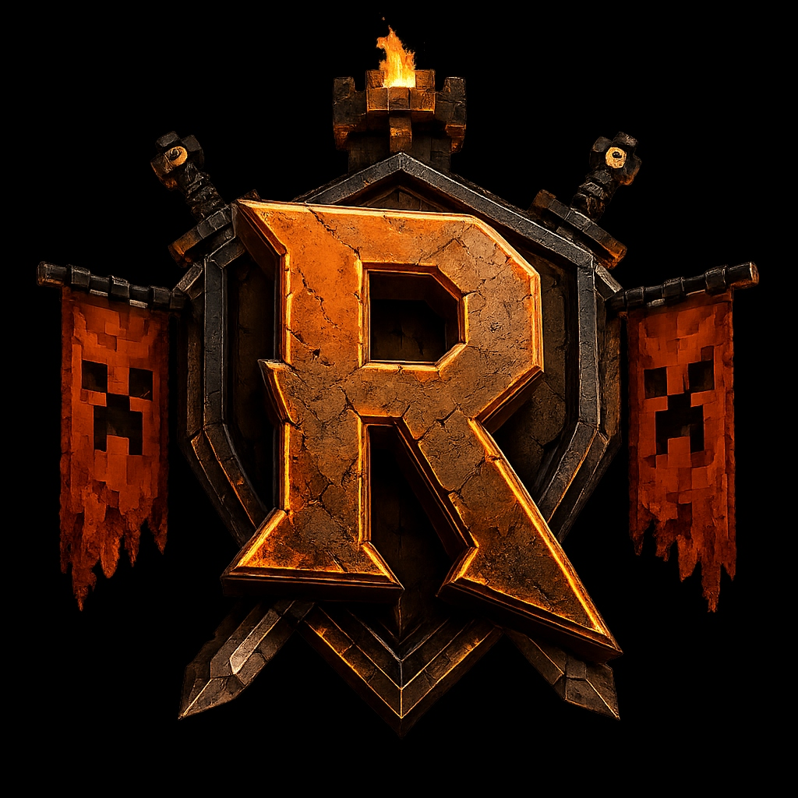
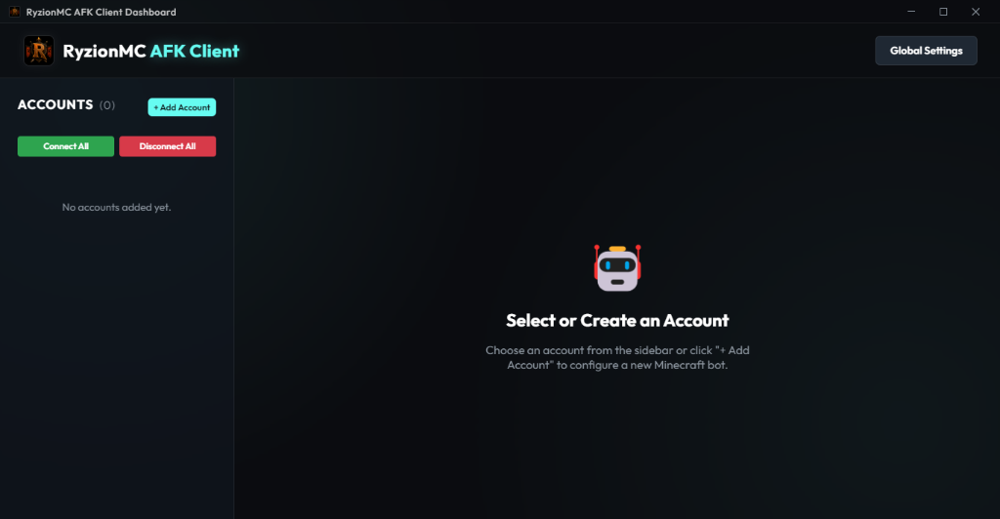

# 🎮 RyzionMC AFK Client

<p align="center">
  
</p>

<p align="center">
  <strong>A powerful, resource-efficient Minecraft AFK Client featuring a sleek Real-Time Web GUI, Smart Auto-Feeding, customizable Anti-AFK, and Advanced AI Chat integration.</strong>
</p>

<p align="center">
  
  
  
  
</p>

<p align="center">
  
</p>

---

## 🌟 Overview

**RyzionMC AFK Client** is a lightweight desktop application designed to keep your Minecraft characters active on multiplayer servers. Unlike running full game clients which consume massive CPU and GPU resources, this client runs completely headlessly using [Mineflayer](https://github.com/PrismarineJS/mineflayer) and provides an interactive web-based panel to control and monitor your characters. 

It is ideal for maintaining in-game farms, keeping chunks loaded, and interacting with players autonomously using generative AI engines.

---

## ✨ Features

### 🖥️ Sleek Web Dashboard
* **Multi-Account Support**: Manage multiple Minecraft accounts simultaneously from a single central panel.
* **Modern Interface**: Clean, responsive layout with real-time status updates (Ping, Health, Food, XP Level, and Progress).
* **Cross-Network Access**: Access the dashboard locally or securely from other devices on your local network.

### 📡 Real-Time Telemetry & Terrain Radar
* **Interactive 25x25 Radar**: Displays block terrain surrounding each bot categorized by type (Grass/Plants, Wood/Dirt, Stone/Ores, Water, Lava, Sand/Gravel).
* **Entity Tracking**: Scan and display surrounding players, friendly mobs, and hostile entities in a 64-block radius.
* **Visual Inventory Manager**: View all item stacks in your inventory, move them around, or drop/toss them directly from the web panel.
* **Position & Direction Tracker**: Live coordinates (X, Y, Z) and head direction (Yaw/Pitch) visualized dynamically.

### 🧠 Advanced AI Auto-Reply Integration
* **Multi-Provider Support**: Integrates seamlessly with **Google Gemini (Gemini 2.5 Flash)**, **OpenAI (GPT-4o mini)**, **Anthropic Claude**, **DeepSeek**, and local **Ollama** instances.
* **Flexible Triggers**: Automatically reply when mentioned, when receiving direct messages (whispers), when specific keywords are triggered, or configure it to respond to all chat messages.
* **System Instructions**: Define custom bot personalities and rules to make the bot sound human, friendly, or helper-oriented.

### 🌾 Smart Auto-Feed & Consumption
* **Dual-Mode Feeding**: Automatically detects hunger or low health. It attempts to use the server `/feed` command first.
* **Inventory Fallback**: If command permission is missing, it dynamically equips and consumes food items (Steaks, Bread, Apples, etc.) from the inventory.
* **Movement Pause**: Temporarily halts Anti-AFK behaviors during eating to avoid breaking consumption animations.

### 🛡️ Smart Anti-AFK & Automation
* **Custom Anti-AFK Modes**: Choose from jumping, walking in random directions, looking around randomly, or a combined dynamic mode.
* **Auto-Reconnect & Auto-Respawn**: Keeps bots online 24/7. Auto-reconnects with a customizable delay after disconnects, and auto-respawns after deaths.
* **Delayed Auto-Commands**: Automatically execute setup commands (e.g., `/login <password>`, `/register`, `/lobby`) on successful login with configurable step delays.

---

## 🛠️ Tech Stack

* **Frontend**: HTML5, Vanilla CSS, WebSockets (Socket.io)
* **Backend**: Node.js, Express, Socket.io
* **Minecraft Protocol**: Mineflayer (supports auto-version negotiation)
* **AI Engines**: `@google/genai` (SDK), native integrations for OpenAI, Claude, DeepSeek, and Ollama APIs
* **Desktop App Wrapper**: Electron (custom borderless frame, system tray, auto-updater integration)

---

## 🚀 Getting Started

### Prerequisites
* [Node.js](https://nodejs.org/) (Version 18 or higher recommended)
* A Minecraft Account (Supports both **Microsoft/Premium** auth and **Offline/Cracked** setups)

### Installation

1. **Clone the Repository:**
   ```bash
   git clone https://github.com/ahmt26/RyzionMC-AFKClient.git
   cd RyzionMC-AFKClient
   ```

2. **Install Dependencies:**
   ```bash
   npm install
   ```

3. **Start the Application:**
   ```bash
   npm start
   ```
   This will launch the borderless Electron desktop window and start the local web dashboard server.

---

## ⚙️ Configuration (`config.json`)

The client creates and manages a configuration file named `config.json`. Below are the primary settings you can customize:

```json
{
  "webPort": 2855,
  "panelUsername": "admin",
  "panelPassword": "1234_change_me",
  "language": "en",
  "geminiApiKey": "your_gemini_api_key",
  "openaiApiKey": "your_openai_api_key",
  "claudeApiKey": "your_claude_api_key",
  "deepseekApiKey": "your_deepseek_api_key",
  "ollamaUrl": "http://localhost:11434",
  "accounts": []
}
```

> [!NOTE]
> * **`webPort`**: The port number on which the Web Dashboard is hosted (Default is `2855`).
> * **`panelUsername` & `panelPassword`**: Credentials required to log into the web control panel from non-localhost connections.
> * **API Keys**: Configure global API keys for your AI assistants. You can also specify keys per-account via the dashboard.

---

## 📱 Web Dashboard Usage

1. Open your browser and navigate to `http://localhost:2855` (or use the local network IP provided in the console).
2. Log in using the `panelUsername` and `panelPassword` from your config.
3. Click **Add Account** to configure new bots:
   * **Username**: The in-game name.
   * **Host / Port**: The IP and port of the Minecraft server.
   * **Version**: Choose a specific Minecraft version or leave blank for auto-negotiation.
   * **Auth Mode**: `offline` (for cracked servers) or `microsoft` (for premium servers).
   * **Auto Commands**: Commands to run after login (e.g. `/register 123456`, `/login 123456`).
   * **AI Chat Config**: Configure AI providers, model name, triggers, and prompt guidelines.
4. Manage, move, inspect inventory, and control movement controls dynamically.

---

## 📦 Packaging & Building

To package the application into a standalone executable for distribution, you can use the built-in Electron builder scripts:

```bash
# Build for current Operating System
npm run dist

# Build specifically for Windows (x64)
npm run dist:win

# Build for macOS
npm run dist:mac

# Build for Linux
npm run dist:linux

# Build for all platforms
npm run dist:all
```
The output installers will be generated inside the `dist/` directory.

---

## 🔒 Security & Protection

* **Failed Attempt Cooldown**: To protect your server from unauthorized external access, the web panel blocks IPs with exponential backoff cooldowns (from 30 minutes up to 1 day) after multiple invalid login attempts.
* **Token Authentication**: WebSocket and HTTP routes are protected using secure HTTP-only session cookies.
* **Rate Limits**: Connection limits block spamming accounts per IP (maximum of 3 accounts allowed per target host/IP, bypassable via developer mode).

---

## 📜 License

This project is licensed under the **MIT License**. See the [LICENSE](LICENSE) file for more details.

---

## ⚠️ Disclaimer

This tool is created for educational and utility purposes. Using automated clients (AFK Bots) may violate the Terms of Service of certain public Minecraft servers, leading to character bans. Use this software responsibly and at your own risk.

**RyzionMC AFK Client is an unofficial utility and is not affiliated with, authorized, associated, endorsed, or sponsored by Microsoft Corporation, Mojang Studios, or any of their affiliates or subsidiaries. Minecraft is a trademark of Mojang Synergies AB.**
